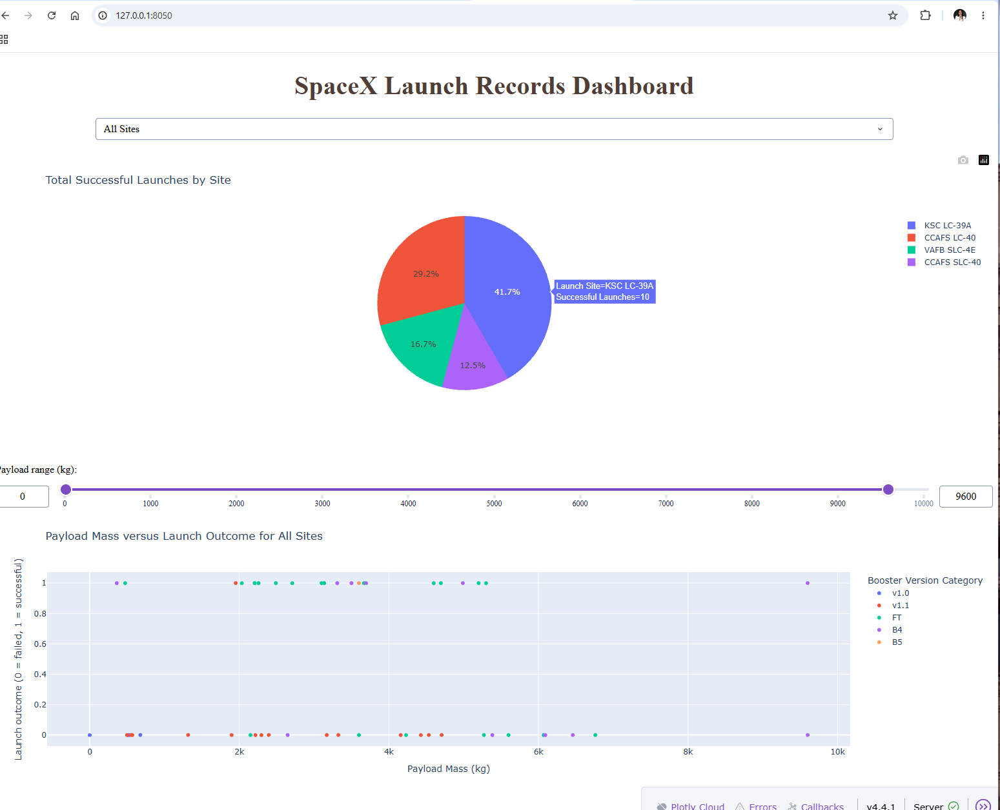
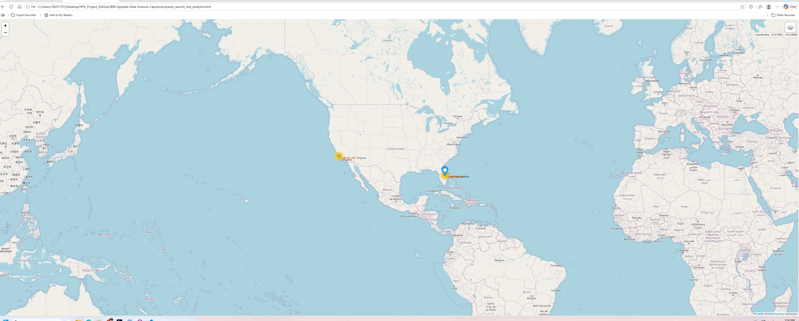
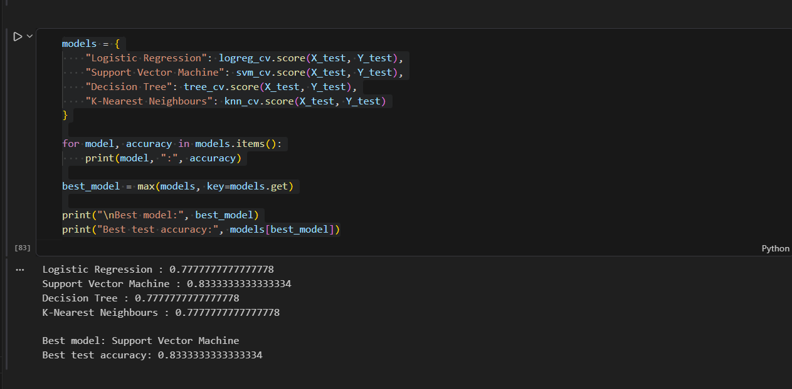

# IBM Applied Data Science Capstone


## 🚀 SpaceX Falcon 9 First Stage Landing Prediction

**Author:** 
Dalal F. S. A. Alhabad

---

## 📖 Project Description

This repository contains my completed **IBM Applied Data Science Capstone**, the final project of the **IBM Data Science Professional Certificate** offered by **IBM Skills Network on Coursera**.

The objective of this project is to develop machine learning models capable of predicting whether the **first stage of a SpaceX Falcon 9 rocket** will successfully land after launch.

Because Falcon 9 is a reusable launch vehicle, accurate prediction of landing success has significant economic value by helping estimate launch costs and booster recovery rates.

The project demonstrates a complete end-to-end data science workflow, including:

- Data collection
- Data wrangling
- Exploratory data analysis
- SQL analysis
- Interactive visualisation
- Machine learning
- Dashboard development

---

## 🎯 Project Objectives

The project aims to:

- Collect historical Falcon 9 launch data
- Clean and prepare the dataset for analysis
- Explore relationships between launch variables and landing success
- Build interactive visualisations
- Develop machine learning models for landing prediction
- Compare model performance and identify the best classifier

---

## 📂 Repository Structure

```
IBM-Applied-Data-Science-Capstone/
│
├── 01_SpaceX_Data_Collection_API.ipynb
├── 02_SpaceX_Web_Scraping.ipynb
├── 03_SpaceX_Data_Wrangling.ipynb
├── 04_SpaceX_EDA_Data_Visualization.ipynb
├── 05_SpaceX_EDA_SQL.ipynb
├── 06_SpaceX_Folium_Launch_Site_Analysis.ipynb
├── 07_SpaceX-Machine-Learning-Prediction.ipynb
├── 08_Spacex_Dash_Application.py
│
├── images/
│   ├── dashboard.png
│   ├── folium_map.png
│   └── ml_results.png
│
├── dataset_part_1.csv
├── dataset_part_2.csv
├── dataset_part_3.csv
├── spacex_launch_dash.csv
├── spacex_launch_site_analysis.html
├── spacex_web_scraped.csv
├── my_data1.db
├── requirements.txt
├── LICENSE
└── README.md
```

---

## 🔬 Project Workflow

The project follows the standard Data Science lifecycle.

### 1. Data Collection

Historical launch data were collected from:

- SpaceX REST API
- Wikipedia

### 2. Data Wrangling

Data preprocessing included:

- Missing value handling
- Feature engineering
- Data cleaning
- Data transformation

### 3. Exploratory Data Analysis (EDA)

EDA was performed using:

- Pandas
- SQL
- Matplotlib
- Plotly

The analysis investigated relationships between:

- Launch Site
- Orbit
- Payload Mass
- Booster Version
- Landing Outcome

### 4. Interactive Visualisation

#### 🌍 Folium Map

- Launch site locations
- Landing outcomes
- Distance calculations
- Geographic analysis

#### 📊 Plotly Dash Dashboard

The interactive dashboard allows users to:

- Select launch sites
- Filter payload ranges
- Explore landing success
- Compare launch statistics

---

## 🤖 Machine Learning

Four supervised learning algorithms were evaluated:

- Logistic Regression
- Support Vector Machine (SVM)
- Decision Tree
- K-Nearest Neighbours (KNN)

Models were trained using **Scikit-learn** and optimised using **GridSearchCV**.

Performance was evaluated using:

- Accuracy
- Confusion Matrix
- Cross Validation

---

## 📊 Key Findings

The analysis demonstrated that:

- Landing success has improved substantially over time.
- Launch site influences landing probability.
- Payload mass affects booster recovery.
- Orbit type contributes to landing success.
- Machine learning models successfully classify landing outcomes with high predictive performance.

---

## 🛠 Technologies Used

### Programming Language

- Python

### Libraries

- Pandas
- NumPy
- Matplotlib
- Plotly
- Dash
- Folium
- BeautifulSoup
- Requests
- SQLite3
- Scikit-learn

### Development Environment

- Jupyter Notebook
- Visual Studio Code

---

## 📦 Installation

Clone the repository:

```bash
git clone https://github.com/dalalalhabad/IBM-Applied-Data-Science-Capstone.git
```

Move into the project folder:

```bash
cd IBM-Applied-Data-Science-Capstone
```

Install the required packages:

```bash
pip install -r requirements.txt
```

---

## 💻 Requirements

This project was developed and tested using:

- Python 3.12
- Jupyter Notebook
- pip

Install all required packages using:

```bash
pip install -r requirements.txt
```

---

## ▶️ Running the Project

Open the notebooks sequentially:

1. Data Collection
2. Web Scraping
3. Data Wrangling
4. Exploratory Data Analysis
5. SQL Analysis
6. Folium Analysis
7. Machine Learning

To launch the interactive dashboard:

```bash
python 08_Spacex_Dash_Application.py
```

---

## 📊 Results

The machine learning models successfully predicted Falcon 9 first-stage landing outcomes.

Key findings include:

- Landing success increased over time.
- Launch site significantly influenced landing probability.
- Payload mass was associated with landing success.
- Orbit type affected landing outcomes.
- GridSearchCV improved model performance by optimising model hyperparameters.

---

# 📷 Project Preview

## 📊 Interactive Dashboard



## 🌍 Folium Interactive Map

The project includes an interactive geospatial visualisation of SpaceX launch sites using **Folium** and **OpenStreetMap**.



## 🤖 Machine Learning Model Comparison

Four supervised learning algorithms were evaluated using **GridSearchCV**.

The **Support Vector Machine (SVM)** achieved the highest predictive accuracy (**83.3%**) on the test dataset.



---

## 📚 Data Sources

- [SpaceX REST API](https://github.com/r-spacex/SpaceX-API)
- [Wikipedia – Falcon 9 and Falcon Heavy Launches](https://en.wikipedia.org/wiki/List_of_Falcon_9_and_Falcon_Heavy_launches)

---

## 🎓 Course Information

**IBM Applied Data Science Capstone**

Part of the **IBM Data Science Professional Certificate**

Delivered through **IBM Skills Network | Coursera**

---

## 👩‍💻 Author

**Dalal F. S. A. Alhabad**

PhD Candidate in Bioinformatics  
Department of Computer Science and Information Technology  
La Trobe University  
Melbourne, Australia

**LinkedIn:**  
https://www.linkedin.com/in/dalalalhabad

**GitHub:**  
https://github.com/dalalalhabad

---

## 🙏 Acknowledgements

This project was completed as part of the **IBM Data Science Professional Certificate** offered through **IBM Skills Network** on **Coursera**.

Special thanks to IBM Skills Network for providing the learning resources, datasets, practical exercises, and project framework used throughout this capstone.

---

## ⭐ Repository Highlights

- ✔ End-to-End Data Science Project
- ✔ API Integration
- ✔ Web Scraping
- ✔ SQL Analysis
- ✔ Interactive Dash Dashboard
- ✔ Folium Geographic Analysis
- ✔ Machine Learning Classification
- ✔ Professional GitHub Portfolio Project

---

## 📈 Repository Statistics

- **Programming Language:** Python
- **Project Type:** End-to-End Data Science Capstone
- **Data Sources:** SpaceX REST API & Wikipedia
- **Machine Learning:** Scikit-learn
- **Visualisation:** Plotly & Folium
- **Database:** SQLite

---

## 🚀 Future Improvements

Potential future enhancements include:

- Deep learning models for launch prediction.
- Automated data updates from the SpaceX API.
- Model deployment using Streamlit or Flask.
- Cloud deployment for the interactive dashboard.
- Additional feature engineering to improve predictive performance.